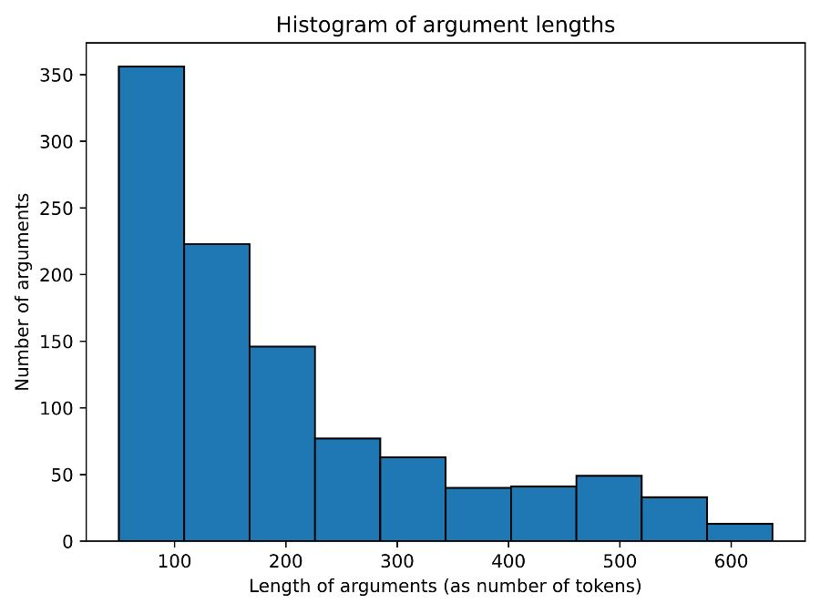
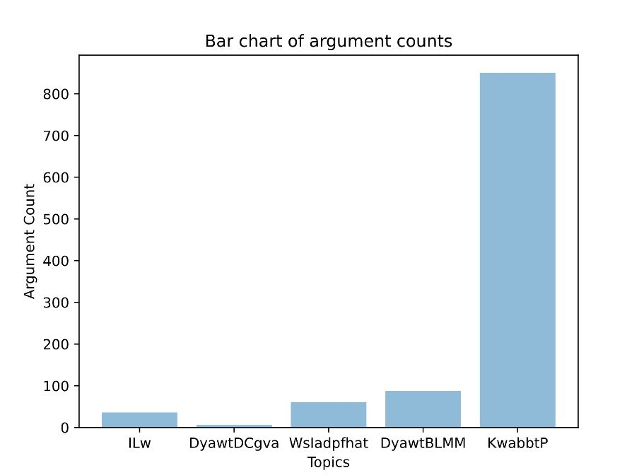
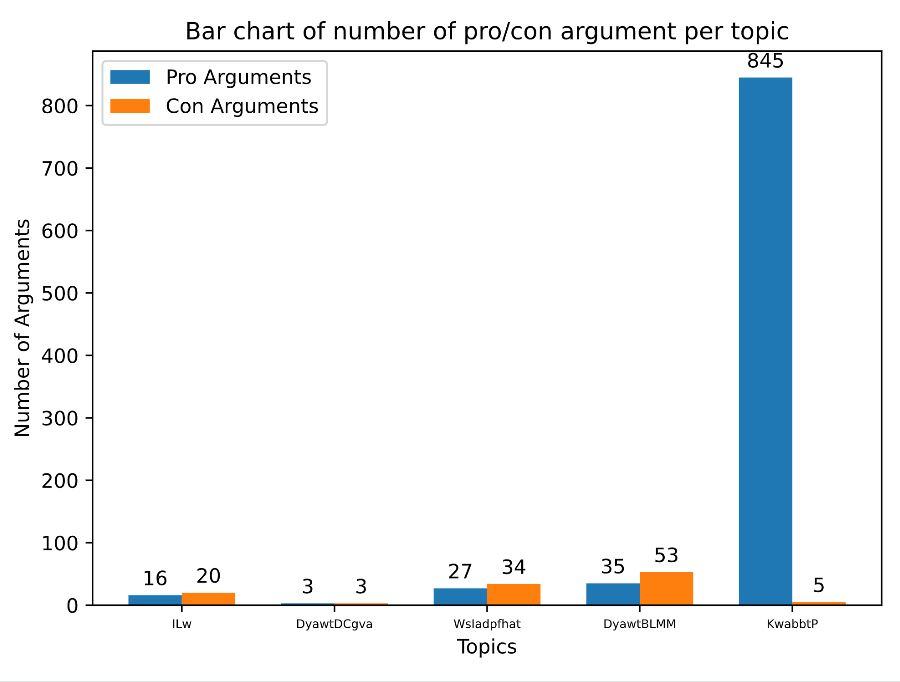
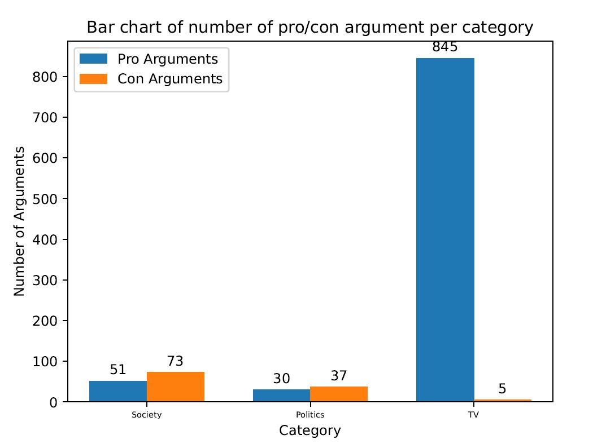

## **Debate Crawler**
The crawler crawls the five most popular opinion pages from *debate.org* and saves them to *data.json* file.  

We use debate.org as `allowed_domains` to crawl the spider and [base_url](https://www.debate.org) which is used to crawl top 5 pages dynamically using `parse_1`. 
In `custom_settings`, we set `ROBOTSTXT_OBEY = False` and declare `FEED_FORMAT= json` and `FEED_URI=data.json` as we are saving the crawled data in JSON format. To load more arguments dynamically on ajax call, we define `ajax_url = 'https://www.debate.org/opinions/~services/opinions.asmx/GetDebateArgumentPage'` and define header elements in `headers` after that. 
An item object containing the three elements URL, topic and category is created in class `DataAcquisitionItem`. 

The following part discusses how the different functions of the crawler work.

### **construct_json_str(index, debateId)**
This is a static method which takes `index` and `debateId` as input parameters and returns a JSON string which is used to show the logging info using `loging.info`.
Its main use case is to generate the JSON string that will be used as the body payload in the parse and parse_detail functions.


### **start_requests(self)**
It creates a data.json file or overwrites it if the file previously exists.
To ensure that the ordering of the topics is based on their popularity, we append the GET-parameter `sort=popular` to the URL. Thus, this function sends a GET request to [https://www.debate.org/opinions/?sort=popular](https://www.debate.org/opinions/?sort=popular) by passing this URL to the `scrapy.http.Request` class and using parse_1 as the callback function.

### **parse_1(self, response)**
This function dynamically selects the top 5 opinion pages (based on popularity) for crawling. The specific URLs for these pages are retrieved from the first 5 anchor tags (`<a>`) with the class `a-image-contain` and are then appended to the `base_url`.
Finally, it yields the response for the webpages generated from `scrapy.http.Request` class and uses the `parse` method as the callback function for further processing.


### **parse(self, response)** 
The ``parse(self, response)`` function is called after every successful crawl and then initial parsing is done on the returned HTML code to extract title and category of each debate.

* The `span.q-title::text` selector is used to extract the name of the **topic** of the debate, which is enclosed with the `<span>` tag with the class ``q-title``. By using `::text`, we extract only the text, not the enclosing HTML tags.

* To extract the **category** of the debate topic, we use ``response.css('div#breadcrumb a::text')[2].get()`` to select the breadcrumb div, discarding everything but the text of the third `<a>` tag inside the breadcrumb.


* `scrapy.http.Request()` is yielded to iterate over all pages of the link passed with `ajax_url` and to parse them further with the callback function `parse_detail`. A dictionary containing the parsed items is defined in the meta parameter and it is passed to the `parse_detail` function to be used later.

### **parse_detail(self, response)** 

With the ``parse_detail`` function, each response is further parsed to extract pro and con arguments and their titles. First, the JSON response is loaded from `response.body`. The extracted data is then split and the first part is stored as pro argument, the second part as con argument. For every pro and con argument response, the argument is extracted with the `li.hasData` selector and a counter is incremented. The **argument title** is then extracted from between `<h2>` tags and the raw **argument body** from `<p>` tags. Then, all additional html tags are removed from the raw body and the result is stored in `body`. 
To determine the length of the arguments, all arguments are tokenized with `nltk` and the length of each argument is stored in the list `token_counts`. This list will later be used to draw the histogram of argument lengths. 
The meta parameter is then updated with `title` and `body` for both types of arguments. When there are no more arguments to parse, the updated parameters are yielded for the following call of the function. Additionaly they are stored in `stats` and `category_stats` for plotting. 

## **Plots**
### **closed(self, reason)**
Once the spider closed, the preliminary statistics on the crawled data are generated and saved in a pdf file.

1. **Histogram of argument lengths**
In this plot, the x-axis shows the length of arguments (counted as the number of tokens) and the y-axis displays the total number of arguments with the respective argument lengths. The data is divided into 10 bins.
Only the data for the arguments of the five most popular debates is shown.
We considered the total number of tokens in an argument body to be the length of that argument.

<p align="center">

</p>

2. **Bar chart of argument counts** 
Here, the x-axis shows the five most popular topics and the y-axis represents the total argument count. The total argument count is the sum of the number of pro and con arguments for each topics.
Since the topic names are quite long, we decided to abbreviate their names in the diagram. The displayed topic name is the concatenation of the first letter of the first 10 words in the topic name (or fewer, if the topic name consists of less than 10 words). We decided on using (up to) 10 letters, because we found that several topic names may start with the same 5 words ("Do you agree with the"). 

<p align="center">

</p>

3. **Bar chart of number of pro/con argument per topic** 
The bar chart depicts the number of pro and con arguments for each topic. Again, the x-axis shows the different topics, whereas the y-axis shows the number of arguments. We use the same naming policy for the topics as in the diagram above.
  
<p align="center">

</p>

4. **Bar chart of number of pro/con arguments per category** 
This bar chart depicts the number of pro and con arguments for each distinct category that was covered in the five most popular topics. The x-axis shows the name of the category, the y-axis the number of arguments. Note that if there are several different debates that belong to the same category, we plot the sum of all their pro resp. con arguments.

<p align="center">

</p>

### **Instructions to run the code** 

```bash 
scrapy crawl debate_crawler 
```

### **Required Libraries**

* json
* scrapy
* matplotlib
* numpy
* nltk
* w3lib
* logging
* datetime
